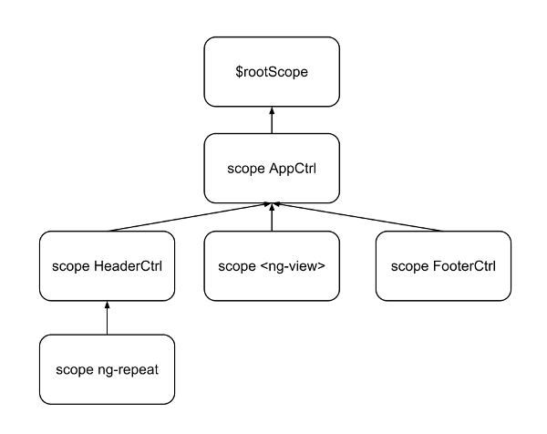
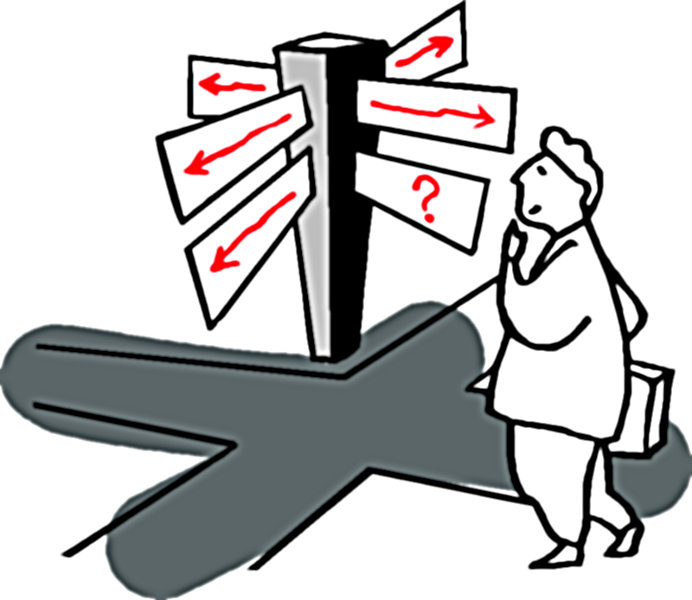
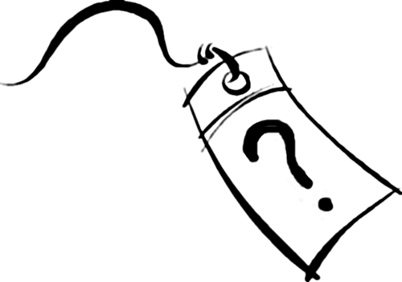
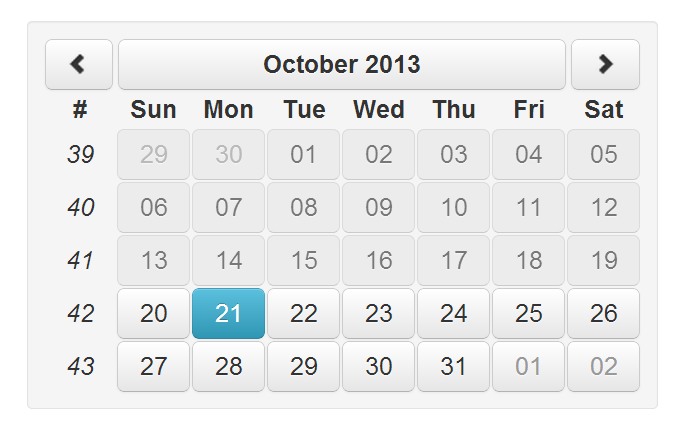

!SLIDE cover ==========================================

### Meetup ngParis - 21 octobre 2013

 

## Attributs et scopes isolés
## dans les directives

  

Thierry Chatel

!SLIDE ===================================================

### _L'isolation des scopes ne donne droit à aucun crédit d'impôt._

!SLIDE subsection ===================================================

# définitions

!SLIDE ===================================================

!SLIDE ===================================================

    <body ng-app="app" ng-controller="AppCtrl">
      

        ...
      

      <ng-view></ng-view>

      

         ...
      

    </body>

!SLIDE ===================================================

# scope et attributs
# liés à **l'élément**

!SLIDE subsection ===================================================

# 3 options pour le scope

!SLIDE bullets big ===================================================

* false : rien
* true : scope enfant
* {...} : scope isolé

!SLIDE ===================================================

!SLIDE bullets ===================================================

# Le scope isolé

* a un parent
* n'hérite pas des propriétés du parent

!SLIDE ===================================================

## _seul cas où_
# `scope.$parent`
## _peut être pertinent_

!SLIDE ===================================================

!SLIDE subsection small ===================================================

# à quoi sert un scope isolé ?

!SLIDE ===================================================

# nommage local des paramètres

!SLIDE bigger ===================================================

    module.directive('google-maps',
                     function factory() {
        return {
            scope: {
                center: '=center',
                zoom: '=zoom'
            },

            ...

!SLIDE bigger ===================================================

    function copy(source, destination) {
        ...
    }

!SLIDE ===================================================

# pas de risque d'impact
# sur le scope parent

!SLIDE subsection small ===================================================

# cas d'utilisation d'un
# scope isolé

!SLIDE ===================================================

# widget

!SLIDE ===================================================

`<google-maps></google-maps>`
  

# élément sans contenu

!SLIDE subsection ===================================================

# bindings du scope isolé

!SLIDE bullets big ===================================================

# 3 types d'attributs

* texte
* expression valeur
* expression action

!SLIDE big ===================================================

# @
## attribut texte

    scope: { prop1: '@attr1' },

!SLIDE bullets small ===================================================

    <person name="{{user.firstName}} {{user.lastName}}"/>

 

    scope: {
        name: '@'
    }

* expressions entre {{...}}
* binding **mono**directionnel

!SLIDE big ===================================================

# =
## expression valeur

    scope: { prop1: '=attr1' },

!SLIDE bullets small ===================================================

    <person name="user.lastName"/>

 

    scope: {
        name: '='
    }

* pas de {{...}} dans l'attribut
* binding **bi**directionnel

!SLIDE big ===================================================

# &
## expression action

    scope: { prop1: '&attr1' },

!SLIDE bullets small ===================================================

    <delete-button action="remove(user)"/>

 

    scope: {
        action: '&'
    }

* pas de {{...}} dans l'attribut
* propriété : fonction
* surcharger des données du scope : `scope.action({user: previousUser})`

!SLIDE subsection ===================================================

# et sans scope isolé ?

!SLIDE big ===================================================

    link: function (scope, element, attrs, ctrl) {
        ...
    }

!SLIDE big ===================================================

# attribut texte (@)

    attrs.xxx

 

    attrs.$observe('xxx', function(value) {
        ...
    });

!SLIDE big ===================================================

# expression valeur (=)

    scope.$watch(attrs.xxx,
                function(newVal, oldVal) {
        ...
    });

 

    $parse(attrs.xxx).assign(scope, value);

!SLIDE big ===================================================

# expression action (&)

    $parse(attrs.xxx)(scope, locals)

!SLIDE subsection small ===================================================

# démo :
# widget Google Maps

