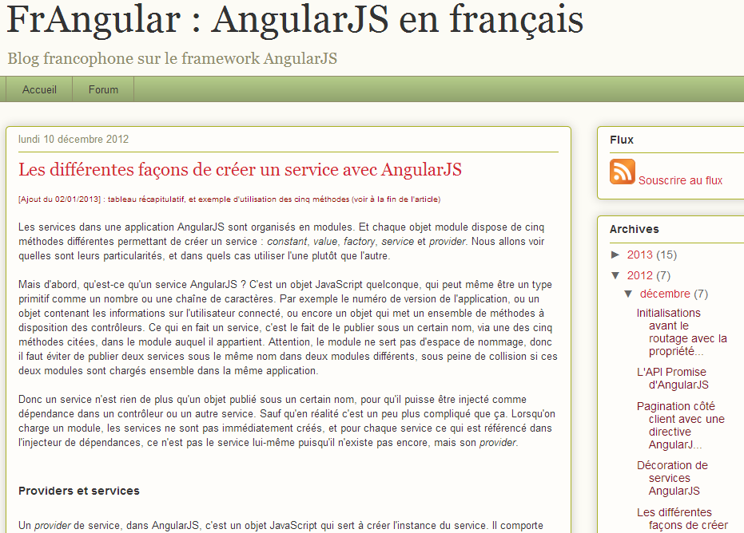

!SLIDE cover ==========================================

### Meetup ngParis - 21 octobre 2013

  

## Usage des services

  

Thierry Chatel

!SLIDE ===================================================

# > 90 % du code
# dans les services

!SLIDE subsection ===================================================

# qu'est-ce qu'un service ?

!SLIDE bullets big ===================================================

* nom

* singleton

!SLIDE ===================================================

# même objet
# /
# même valeur primitive

!SLIDE ===================================================

# injection des dépendances
### instanciation si nécessaire

!SLIDE image ===================================================

!SLIDE subsection ===================================================

# que mettre en service ?

!SLIDE bullets  ===================================================

* tout le code métier
* le code de présentation
* les requêtes
* le modèle
* etc.

!SLIDE big ===================================================

# 1. le code métier

!SLIDE ===================================================

# isoler
# chaque fonctionnalité

!SLIDE image ===================================================

!SLIDE big ===================================================

# 2. le code de présentation

!SLIDE ===================================================

# ex : cache des critères
# ex : notifications

!NOTES -----------------------------------------------------

TODO

!SLIDE big ===================================================

# 3. les requêtes

!SLIDE bullets ===================================================

# service asynchrone

* demander un callback
* renvoyer un objet/tableau alimenté plus tard
* renvoyer une promise

!SLIDE big ===================================================

# 4. le modèle

!SLIDE bullets  ===================================================

# service statefull

* données
* traitements

!SLIDE bullets ===================================================

# service stateless

* bibliothèque de fonctions

!SLIDE subsection ===================================================

# découper les services

!SLIDE ===================================================

# $http
# &
# $httpBackend

!SLIDE ===================================================

# $route
# &
# $location

!SLIDE bullets ===================================================

# découpage en couches

* traitements sur les données
* communication

!SLIDE bullets ===================================================

# service simple et isolé

* facile à tester
* facile à mocker

!SLIDE subsection ============================================

# les 5 règles d'or
# des services

!SLIDE regle ===================================================

# Règle n°1
 
## Jamais de logique ou de
## règle métier dans les
## contrôleurs et les templates.
### Faire un service.

!SLIDE regle ===================================================

# Règle n°2
 
## Oublier les événements !
### Faire un service.

!SLIDE regle ===================================================

# Règle n°3
 
## Dans le doute, faire un service.

!SLIDE regle ===================================================

# Règle n°4
 
## Quand un service
## ne semble pas approprié,
## faire quand même un service.

!SLIDE regle ===================================================

# Règle n°5
 
## Dans tous les autres cas,
## faire un service.

!SLIDE subsection ===================================================

# question de noob

!SLIDE big ===================================================

## _“Comment faire communiquer deux contrôleurs ?”_

!SLIDE  ===================================================

!SLIDE big ===================================================

## On ne le fait pas.
### Les deux contrôleurs utilisent
### le même service.

!SLIDE subsection small ===================================================

# exemple 1 : cache des critères de recherche

!SLIDE big ===================================================

## service = objet vide

    module.value('search', {});

!SLIDE big ===================================================

## publié dans le scope

    $scope.search = search;

!SLIDE big ===================================================

## bindings dans le service

    <input name="filter" ng-model="search.filter"/>

!SLIDE big ===================================================

## cache plus sophistiqué
### utiliser le service $cacheFactory

!SLIDE subsection ===================================================

# exemple 2 : utilisateur connecté

!SLIDE big ===================================================

## service `'user'`

### données

    profile:  {
        firstname: "Thierry",
        lastname: "Chatel"
    }

!SLIDE big ===================================================

## service `'user'`

### fonctions

    hasRole: function (role) {
        return ...
    }

!SLIDE big ===================================================

## publié dans $rootScope

### entièrement
### ou partiellement

    viewObject: {
        ...
    }

!SLIDE subsection ============================================

# exemple 3 : entités persistentes

!SLIDE ============================================

# pattern Active Record

!SLIDE ============================================

# pattern Repository

!SLIDE ============================================

# pattern Entity Home

!NOTES -----------------------------------------------------

TODO et aussi EntityHome ?

!SLIDE subsection ============================================

# exemple 4 : erreurs et notifications

!SLIDE bullets ===================================================

* service `'notifications'`
* service `'errors'`
* service `'$exceptionHandler'` surchargé
* intercepteur $http

!SLIDE bullets ===================================================

## service `'notifications'`

* données : message courant, retiré après quelques secondes
* gestion du _Undo_
* la vue affiche simplement le message courant

!SLIDE bullets ===================================================

## service `'errors'`

* appelle le service `'notifications'`

!SLIDE ===================================================

!SLIDE subsection ============================================

# démo : notifications

